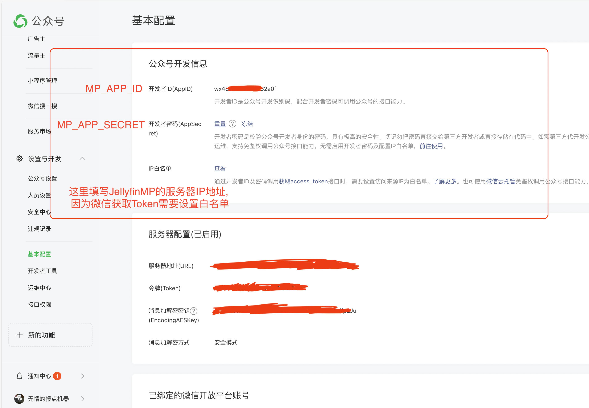
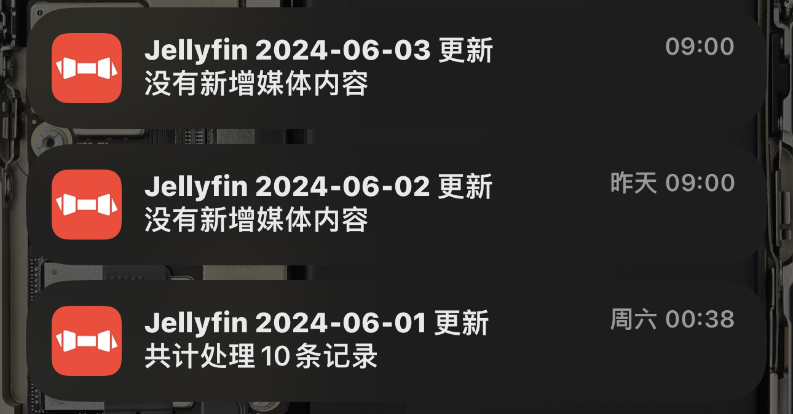

# WXMP Article Generator

## 介绍

简单通过接口发布一篇公众号文章

## 快速开始

### 准备工作

1. 需要有公网可访问地址, 端口可以自己设置. (微信Token获取需要IP白名单)
2. 作为管理者拥有一个微信订阅号, 不一定需要认证.
3. 部署好的MySql8.0, 并且创建好数据库`mpag`: `create database mpag;`.
4. 部署好的Bark服务(可选).

### 前期设置

1. 登录微信开放平台, 获取AppId和AppSecret. 
2. 设置IP白名单, 白名单IP填写运行本服务的机器. (详情见下文参数说明)

### 启动

```shell
docker run -d \
  --name mpag \
  --restart=unless-stopped \
  -p 58089:8089 \
  -e DATABASE_URL=localhost:3306 \
  -e DATABASE_USER=user \
  -e DATABASE_PASS=pass \
  -e BARK_SERVER=bark.changeme.com \
  -e BARK_DEVICE=changeme_bark_device_id \
  -e MP_APP_ID=changeme_app_id \
  -e MP_APP_SECRET=changeme_app_secret \
  martin0313/mpag:latest
```

### 第一次使用

1. 所有参数设置正确并做完所有准备工作后`docker run`, mpag会立即获取一次微信AccessToken.
2. 调用接口`/generator`, `body.article`填写文章内容, 即可生成文章到你的公众号.

## 参数说明

### MySql数据库 (必填项)

DATABASE_URL: 数据库连接地址

DATABASE_USER: 数据库用户名

DATABASE_PASS: 数据库密码

### 微信公众号开发信息 (必填项)

对接[微信公众号](https://mp.weixin.qq.com/)必需的信息, 如果没有公众号可参考资料注册一个**订阅号**即可. 

在微信公众平台除了获取到所需的appId和appSecret之外, 还需要填写IP白名单, 因为微信的Token获取是白名单限制的. 

MP_APP_ID: 微信公众平台应用ID

MP_APP_SECRET: 微信公众平台应用密钥

获取和填写方式参考下图:



### 应用本身配置 (非必填)

此应用本身的一些配置选项

MP_POST_TO_MP_NEWS: 是否将内容发布到微信普通文章, 一般来说默认为false即可, 不启用这个功能. 这里发布的文章仅仅是从草稿箱发布, 不会推送给订阅用户. 
并且不会出现在公众号历史消息中. 具体参考[微信文档](https://developers.weixin.qq.com/doc/offiaccount/Publish/Publish.html)

MP_SEND_TO_ALL: 是否将内容推送给所有订阅用户. 一般来说默认为false即可, 因为将文章自动推送给订阅用户的能力需要公众号进行认证, 认证有一定的门槛. 
这里填写为false, 每天9:00从草稿箱点击一下群发即可, 顺便也可检查一下生成的内容. 
具体参考[微信文档关于群发消息的说明](https://developers.weixin.qq.com/doc/offiaccount/Getting_Started/Explanation_of_interface_privileges.html)

### Bark推送 (非必填)

[Bark](https://github.com/Finb/Bark) 推送文章处理情况.

BARK_SERVER: BARK服务器地址

BARK_DEVICE: BARK设备ID, 注册BARK服务后可以获得, 详情移步BARK官方仓库说明



### 所有参数汇总

| 参数名               | 必填 | 默认值                | 说明                               |
|----------------------|----|--------------------|----------------------------------|
| `DATABASE_URL`       | 是  | `localhost:3306`   | 数据库连接URL                         |
| `DATABASE_USER`      | 是  | `user`             | 数据库用户名                           |
| `DATABASE_PASS`      | 是  | `pass`             | 数据库密码                            |
| `UPDATE_DATABASE`    | 否  | `true`             | 是否更新数据库 (false常用于debug, 默认为true) |
| `BARK_SERVER`        | 否  | `http://localhost` | Bark服务器地址                        |
| `BARK_DEVICE`        | 否  | `无`                | Bark设备标识符                        |
| `MP_POST_TO_MP_NEWS` | 否  | `false`            | 是否将内容发布到微信普通文章（`true` 或 `false`） |
| `MP_SEND_TO_ALL`     | 否  | `false`            | 是否将文章群发推送给订阅用户（`true` 或 `false`） |
| `MP_APP_ID`          | 是  | `无`                | 微信公众平台应用ID                       |
| `MP_APP_SECRET`      | 是  | `无`                | 微信公众平台应用密钥                       |
